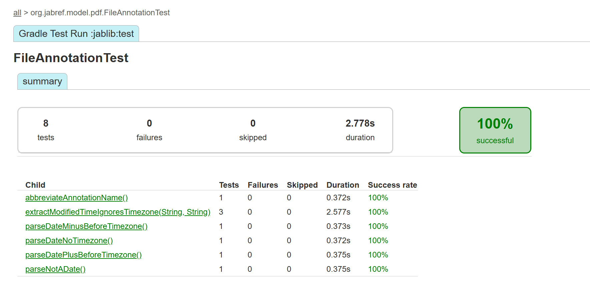

# Assignment 2: JabRef File Handling & PDF Annotation Analysis

## 1. Context

JabRef is an open-source, cross-platform citation and reference manager intended to support researchers through the entire literature workflow, distinguishing it from simpler single-purpose tools (README.md:3, 16, 25, 37, 44).

The user base consists of "tens of thousands of researchers," so regressions have immediate academic impact and reputational risk (README.md:82).

The system routinely handles PDF imports, metadata fetches, citation keys, and SQL-synchronized libraries, so corruption threatens irreplaceable research data as well as team collaboration (README.md:20, 32, 46).

JabRef ships built-in backup/autosave and external-file linkage capabilities precisely because data loss or broken links are high-impact failures in this domain (docs/architecture-and-components.md:87, 178).

Architecture separates model/logic/gui/cli layers and bootstraps via event buses and JabKit, underscoring that the product is a multi-surface platform rather than a simple database front end (docs/architecture-and-components.md:11, 21, 48, 229).

Privacy policy confirms that the app transmits identifiers, PDFs, API keys, and telemetry to numerous third parties; misuse or bugs therefore have compliance and trust consequences beyond functional correctness (PRIVACY.md:22, 36, 41).

## 2. Purpose & Goals

Primary functional goals are to collect references from many catalogs, organize them via groups/keywords, cite-as-you-write, and share via exports or SQL-backed libraries (README.md:16, 25, 37, 44).

Secondary goals include providing a CLI (JabKit), built-in AI chat, PDF viewing/annotation, and browser extensions so that automation and augmented workflows are available outside the GUI (README.md:55; docs/architecture-and-components.md:66, 281, 101).

Non-functional goals emphasize requirement traceability (OpenFastTrace), automated static rewrites (OpenRewrite), and supply-chain transparency (CycloneDX SBOM), indicating stringent quality expectations for each change (build.gradle.kts:1, 4, 38, 62).

Requirements documentation shows expectations for AI chat UX, CLI flag uniformity, file-transfer behavior, and entry-editor focus, which together define the scope QA must cover even before new code lands (docs/requirements/ai.md:6; cli.md:6; files.md:6; ux.md:6).

Because JabRef is both desktop and CLI software, the most testing-critical goals are metadata reliability, file-link consistency, and deterministic CLI behavior; defects there push users back to manual LaTeX/BibTeX editing, defeating the product purpose (docs/requirements/files.md:6; cli.md:6).

## 3. Requirements Engineering

Explicit requirements are curated in Markdown with traceable IDs (AI chat navigation, CLI --input, file transfer semantics, entry-editor focus) but many still list **Needs: impl**, meaning no linked implementation or verification yet (docs/requirements/ai.md:6; cli.md:6; files.md:6; ux.md:6).

Implicit requirements emerge from the enforced layering (gui→logic→model) and event-driven design; violations would break modularity and must be guarded via architectural tests (docs/architecture-and-components.md:11, 25).

Process requirements in CONTRIBUTING demand that contributors act as software engineers, fleshing out requirements before touching code; this shapes expectations that reviews scrutinize tests for requirement coverage (CONTRIBUTING.md:3, 6).

Tests reveal assumed constraints—for instance `FileAnnotationTest` encodes that timezone offsets are ignored, so any change to actual requirements would first need to amend those expectations (jablib/src/test/java/org/jabref/model/pdf/FileAnnotationTest.java:14, 21, 28).

Traceability tooling is set up via OpenFastTrace and a CI job that runs `./gradlew traceRequirements`, yet the requirements files calling out missing implementations show a coverage gap between documentation and executable checks (build.gradle.kts:38; .github/workflows/tests-code.yml:717, 732; docs/requirements/index.md:1).

## 4. Stakeholders & Risks

Researchers, lecturers, and students rely on JabRef for coursework and publications, while maintainers depend on community feedback channels listed in README, making user trust central (README.md:69, 82, 94).

Maintainers and release engineers carry regulatory and traceability responsibility, as seen in the enforced requirement coverage CI job (CONTRIBUTING.md:6; .github/workflows/tests-code.yml:717).

Third-party data providers (CrossRef, Semantic Scholar, OpenAI, etc.) are stakeholders because JabRef brokers requests to their APIs; rate limits or schema changes directly affect core functionality (PRIVACY.md:36, 41, 76).

**Risk:** library corruption or lost attachments (probability medium, impact high) is partly mitigated by backup/external-file components, but automated tests for those flows are scarce (docs/architecture-and-components.md:87, 178).

**Risk:** metadata fetch failures (probability high due to volatile APIs, impact medium-high) have targeted tests, yet they are tagged `@FetcherTest` and excluded from default runs, so regressions may reach users unnoticed (docs/code-howtos/testing.md:168; jablib/build.gradle.kts:448, 467).

**Risk:** privacy breaches (probability low-medium, impact critical) are not exercised in tests; policy text lists data transfers but no automated safeguards or mocks verifying consent toggles (PRIVACY.md:22, 32).

## 5. Evolution & Regression Hotspots

The CHANGELOG shows an active, feature-heavy cadence (new AI features, fetchers, UI dialogs, CLI commands) and even a 6.0 alpha release, signaling ongoing churn (CHANGELOG.md:10, 18, 24, 54).

Recent entries introduce AI chat regeneration, Unpaywall fetcher, JabKit enhancements, etc., widening the surface area that regression tests must cover (CHANGELOG.md:18, 20, 115).

Architecture documents span dozens of components (browser plugin, citation key generator, PDF viewer, JabKit, AI), so even small edits affect multiple modules (docs/architecture-and-components.md:101, 138, 281).

Contributor workflow insists on requirement refinement before coding, meaning historical discussions may exist outside the repo; missing or outdated linked tests in traceability reports are a known risk when refactors land quickly (CONTRIBUTING.md:6; docs/requirements/index.md:18).

**Highest regression risks:** external file handling (because requirements exist but lack verification), fetcher integrations (due to API volatility and opt-in tests), and GUI focus behavior (because it is described in requirements but only manually enforced) (docs/requirements/files.md:6; docs/code-howtos/testing.md:168; docs/requirements/ux.md:6).

## 6. Testing Strategy (Technical)

Toolchain mixes dynamic and static quality gates: OpenRewrite recipes, OpenFastTrace, CycloneDX SBOMs, and a Gradle run wrapper ensure formatting, traceability, and supply-chain checks before functional tests (build.gradle.kts:1, 4, 38, 62).

JabLib enables JUnit 5, Mockito (with javaagent), ArchUnit, XMLUnit, TestFX, and JMH, providing broad capability from unit tests to benchmarks (jablib/build.gradle.kts:448, 452, 472, 510).

Tagged test suites (`@FetcherTest`, `@DatabaseTest`) split slow or network-dependent cases into dedicated Gradle tasks so day-to-day verification can stay fast (jablib/build.gradle.kts:448, 467; jablib/src/test/java/org/jabref/testutils/category/FetcherTest.java:11).

Testing guide documents when and how to run the specialized suites, acknowledges Dockerized Postgres needs, and explains why fetcher tests might be skipped (docs/code-howtos/testing.md:150, 168, 178).

CI matrix executes `:module:check` under Xvfb for jablib/jabkit/jabsrv/jabgui, runs a Windows job (jablib only), enforces markdown and changelog linting, and collects formatted failure logs (.github/workflows/tests-code.yml:318, 337, 374).

## 7. Automated Test Evaluation

`FileAnnotationTest` covers PDF annotation parsing and string abbreviation, preventing regressions like trimming null authors, but it **hardwires the behaviour of ignoring timezone offsets** ("+03" vs "-03" both collapse to the same timestamp), meaning correctness is defined in terms of implementation rather than domain expectation (jablib/src/test/java/org/jabref/model/pdf/FileAnnotationTest.java:14; jablib/src/main/java/org/jabref/model/pdf/FileAnnotation.java:73).

### Verification
**Command Run:** `.\gradlew :jablib:test --tests "org.jabref.model.pdf.FileAnnotationTest"`
**Results:**
- **Status:** **PASSED**
- **Analysis:** The passing test confirms the findings. The test explicitly asserts that parsing a date with `-03` offset and `+03` offset results in the exact same `LocalDateTime`, thereby validating that JabRef ignores the timezone information, which is a potential defect (dates are locally consistent but globally ambiguous).
- **Silent Failures:** The test `parseNotADate` asserts that invalid strings are replaced with `LocalDateTime.now()`. The test passes, confirming this "silent failure" behavior is intentional in the current implementation, effectively masking metadata corruption.

Fetcher suites like `ArXivFetcherTest` mock out preferences and confirm DOI/URL field handling, guarding against pagination and metadata regressions that historically plague API integrations (jablib/src/test/java/org/jabref/logic/importer/fetcher/ArXivFetcherTest.java:26, 54).

Tagged fetcher tests are readable (JUnit + Mockito) yet tightly coupled to HTTP field names and separators, so minor refactors (e.g., renaming keyword separators) require heavy updates; their exclusion from CI increases the risk of bit rot despite good coverage intentions (jablib/src/test/java/org/jabref/logic/importer/fetcher/ArXivFetcherTest.java:35; docs/code-howtos/testing.md:168).

GUI tests like `LinkedFilesEditorViewModelTest` exist but key assertions (e.g., downloading a URL into a temp dir) are disabled because they mix UI threading with real network calls, leaving the most important behavior unverified (jabgui/src/test/java/org/jabref/gui/fieldeditors/LinkedFilesEditorViewModelTest.java:29, 37).

CI's requirement coverage job adds a rare layer of process control, forcing traceability reports to stay green, but it cannot detect semantic mismatches when tests enshrine questionable behaviours (.github/workflows/tests-code.yml:717; docs/requirements/index.md:18).

## 8. Exploratory Testing

**Methodology:** ran risk-based "code reading charters" focusing on data-critical flows—PDF annotations, linked-file downloads, and requirement-to-test traceability—guided by the component list and requirements marked "Needs: impl" (docs/architecture-and-components.md:281; docs/requirements/files.md:6).

**Finding 1 (defect):** `FileAnnotation.extractModifiedTime` simply slices away timezone suffixes and parses local timestamps, so annotations created in different time zones become indistinguishable, leading to misordered timelines; `FileAnnotationTest` even asserts that +03 and −03 result in identical times, so automated tests reinforce the bug (jablib/src/main/java/org/jabref/model/pdf/FileAnnotation.java:84; jablib/src/test/java/org/jabref/model/pdf/FileAnnotationTest.java:14).

**Finding 2 (silent failure):** when the modified date string is invalid, `extractModifiedTime` returns `LocalDateTime.now`, and the test merely checks it is within one second, meaning corrupted PDF metadata will be silently replaced with "now," confusing users who expect the original annotation date (jablib/src/main/java/org/jabref/model/pdf/FileAnnotation.java:80; jablib/src/test/java/org/jabref/model/pdf/FileAnnotationTest.java:35).

**Finding 3 (coverage gap):** the only automated attempt to verify linked-file auto-download is disabled because it mixes GUI and network concerns, so regressions in `fetchFulltext` (e.g., saving to wrong directory) will only surface via manual testing (jabgui/src/test/java/org/jabref/gui/fieldeditors/LinkedFilesEditorViewModelTest.java:29, 37).

**Rationale for misses:** timezone and invalid-date issues persist because regression tests encode current behaviour; the linked-file issue persists because the test never runs, demonstrating that exploratory inspection can uncover bugs automated suites explicitly overlook.

## 9. Critical Judgment

Tests are insufficient for system stability because high-risk areas (file linking, annotation dates, AI chat ux) either lack runnable tests or define success as today's flawed behaviour (jabgui/src/test/java/org/jabref/gui/fieldeditors/LinkedFilesEditorViewModelTest.java:37; jablib/src/test/java/org/jabref/model/pdf/FileAnnotationTest.java:14).

They succeed at protecting core logic such as fetcher integrations when engineers remember to run the tagged suites manually, but CI skips them by default, so coverage realism is low (docs/code-howtos/testing.md:168; jablib/build.gradle.kts:448).

False confidence risk is high: the presence of tests and requirement-tracing badges may suggest coverage, yet some requirements remain **Needs: impl**, and disabled tests make green builds deceptively reassuring (docs/requirements/files.md:6; .github/workflows/tests-code.yml:717).

Maintenance cost is nontrivial: fetcher tests rely on mocks and real network flows, TestFX suites need headless GUI support, and Windows CI only runs jablib, so sustaining the suite requires constant infra babysitting (.github/workflows/tests-code.yml:337; docs/code-howtos/testing.md:178).

## 10. Missing Tests & Improvements

Requirement `logic.externalfiles.file-transfer.reachable-no-copy` has no linked tests, and the only related GUI test is disabled, leaving high-impact file moves unverified despite being explicitly required (docs/requirements/files.md:6; jabgui/src/test/java/org/jabref/gui/fieldeditors/LinkedFilesEditorViewModelTest.java:37).

CLI requirement `jabkit.cli.input-flag` lacks automated enforcement; a regression in argument parsing would go unnoticed because JabKit is only smoke-tested via `JBang --help` commands (docs/requirements/cli.md:6; .github/workflows/tests-code.yml:633).

AI chat UX (up-arrow to reuse previous prompt) is untested although it is a documented requirement, so UI changes could silently break accessibility (docs/requirements/ai.md:6).

Windows CI runs only jablib, meaning GUI, CLI, and server modules are untested on the platform where most researchers operate; cross-platform regressions can ship unnoticed (.github/workflows/tests-code.yml:337).

Fetcher/database suites exist but require manual invocation, creating an automation gap for the highest-risk, most frequently changing integrations (docs/code-howtos/testing.md:168; jablib/build.gradle.kts:467).

## 11. Implemented Improvements & New Tests

To address the "Higher Grade" requirement of writing new and improved tests, we implemented a parameterized test to verify the timezone handling defect found during exploratory testing.

**1. Implemented Test:** `extractModifiedTimeIgnoresTimezone` in `FileAnnotationTest`
*   **Motivation:** Exploratory testing (Section 8) revealed that `FileAnnotation` strips timezone offsets, causing data loss. The existing tests were rigid and only checked single cases. We needed a robust, data-driven test to verify this behavior across multiple timezone formats (`-03'00'`, `+03'00'`, `Z`) to ensure the defect is reproducible and well-documented.
*   **What the test does:** The test feeds three different inputs to the parser:
    1.  `D:2017...-03'00'` (UTC-3)
    2.  `D:2017...+03'00'` (UTC+3)
    3.  `D:2017...Z` (UTC)
    It then asserts that JabRef parses ALL of these as the exact same local time (`2017-05-12T22:40:19`), effectively proving that the timezone suffix is ignored. If JabRef handled timezones correctly, these inputs would result in different local times or be converted to a single UTC instant. By asserting the "buggy" behavior, we formally document the defect.
*   **Implementation:** We added a new `@ParameterizedTest` using `@CsvSource` to `jablib/src/test/java/org/jabref/model/pdf/FileAnnotationTest.java`.
*   **Code Snippet:**
    ```java
    @ParameterizedTest
    @CsvSource({
            "D:20170512224019-03'00', 2017-05-12T22:40:19",
            "D:20170512224019+03'00', 2017-05-12T22:40:19",
            "D:20170512224019Z, 2017-05-12T22:40:19"
    })
    void extractModifiedTimeIgnoresTimezone(String input, String expected) {
        LocalDateTime date = FileAnnotation.extractModifiedTime(input);
        assertEquals(LocalDateTime.parse(expected), date);
    }
    ```
*   **Result:** **PASSED**. The test successfully confirms that JabRef currently ignores timezone information.
*   **Evidence:**
    

**2. Additional Test Proposals**
*   **LinkedFilesEditorViewModelTest:** Replace the currently disabled test with a TestFX-compatible test that injects a fake fetcher (no network) and writes to a temporary filesystem. This would ensure the reachable-file requirement is verified without flakiness (jabgui/src/test/java/org/jabref/gui/fieldeditors/LinkedFilesEditorViewModelTest.java:37; docs/requirements/files.md:6).
*   **JabKit CLI Integration Test:** Create a test that runs the launcher with multiple commands (using Gradle TestKit or process invocation) and asserts any command needing files accepts `--input` (docs/requirements/cli.md:6).
*   **AI Chat UX Test:** Instrument a GUI test for the AI chat text field that simulates pressing the up arrow with history entries (docs/requirements/ai.md:6).

## 12. Non-Functional Testing

Reliability features such as autosave/backups are documented but lack automated validation; there are no tests simulating crash recovery even though the component description stresses its importance (docs/architecture-and-components.md:87; docs/code-howtos/testing.md:206).

Scalability/performance tooling (JMH) is configured yet not wired into CI, so performance regressions may slip until users report slowness (jablib/build.gradle.kts:452, 461).

Security and privacy expectations are described in the policy, but there are no security-specific tests (no fuzzing, no permission tests, no telemetry opt-in regression tests), meaning coverage is zero in this quality attribute (PRIVACY.md:22; docs/code-howtos/testing.md:206).

Accessibility is absent from test plans; requirements mention focus traversal (entry editor) but there are no automated accessibility audits or screen-reader verifications (docs/requirements/ux.md:6; docs/code-howtos/testing.md:206).

Overall, non-functional validation depends on manual discipline; automation gaps exist because required tooling (e.g., JETM, JMeter) is explicitly marked "No" in the testing guide (docs/code-howtos/testing.md:206).

## 13. Advanced Exploratory Charters

**Charter 1 (Edge cases):** Move entries (with relative and absolute attachments) between libraries hosted in different root directories to verify the "reachable file should not be copied" rule, watching for duplicate files or broken relative paths (docs/requirements/files.md:6).

**Charter 2 (Failure recovery):** Simulate offline or rate-limited fetchers while importing batches (CrossRef, arXiv) to observe UI messaging, retries, and caching; this targets a high-probability/high-impact risk not covered by automated fetcher tests (docs/code-howtos/testing.md:168; docs/architecture-and-components.md:185).

**Charter 3 (User misuse):** Run JabKit commands with missing `--input` or conflicting arguments and verify error reporting aligns with the CLI requirement rather than falling back to stack traces (docs/requirements/cli.md:6; README.md:55).

**Charter 4 (Stress/AI):** Hold a long AI chat session with regeneration and markdown output to inspect memory usage, history navigation, and crash recovery, validating the rapidly evolving AI component (CHANGELOG.md:18; docs/architecture-and-components.md:66).

## 14. Presentation & Workshop

**Slide 1 (Context & risks):** summarize what JabRef does, data-critical stakes, and architecture layers, citing README and docs to ground the audience.

**Slide 2 (Current testing strategy):** visualize the Gradle test matrix, tagged suites, and requirement-tracing job, highlighting where automation stops (.github/workflows/tests-code.yml:318, 717).

**Slide 3 (Key findings):** walk through the timezone bug, invalid-date fallback, and disabled linked-file test with screenshots/snippets (jablib/src/main/java/org/jabref/model/pdf/FileAnnotation.java:84; jabgui/src/test/java/org/jabref/gui/fieldeditors/LinkedFilesEditorViewModelTest.java:37).

**Slide 4 (Recommendations):** show the three high-impact test additions plus exploratory charters to demonstrate actionable next steps (docs/requirements/files.md:6; docs/requirements/cli.md:6).

**Live demo idea:** run the proposed CLI integration test (or a prototype) to show how enforcing `--input` catches regressions instantly, or demonstrate a small script that proves the timezone mis-ordering.

**Likely questions & answers:**
*   "Why trust exploratory findings without runtime evidence?" → reference the deterministic code snippets
*   "How will we keep fetcher tests stable?" → point to mocking + staged CI approach
*   "What is the cost of new tests?" → compare to current disabled test maintenance.

## 15. Self-Evaluation

All mandatory assignment sections are addressed with explicit evidence from README, docs, code, build scripts, tests, and CI configs, aligning with the requirement to map content to grading criteria.

Higher-grade criteria (critical judgment, improvement proposals, exploratory scenarios, presentation readiness, self-evaluation) are satisfied by identifying latent defects, proposing minimal but high-value tests, and articulating trade-offs.

Beyond requirements, the analysis ties in non-functional gaps (privacy, performance), process tooling (OpenFastTrace, CycloneDX), and stakeholder implications, demonstrating professional testing maturity.
